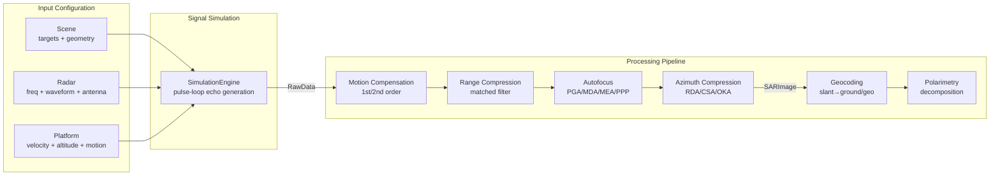
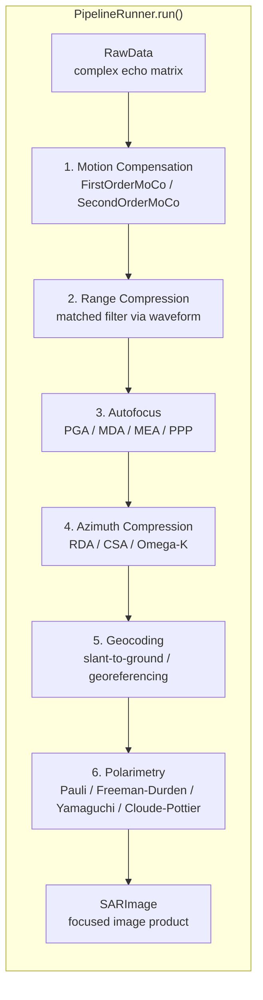
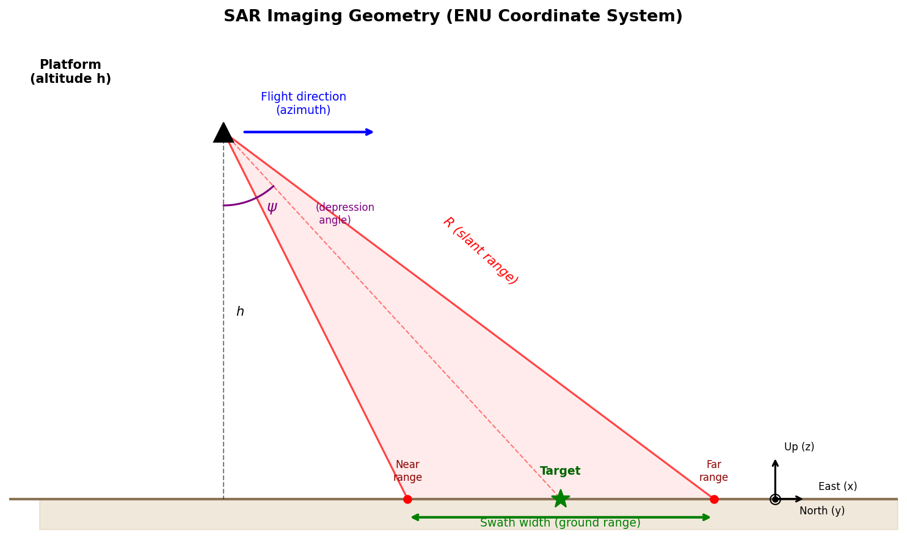

# Program Organization

This chapter describes the package structure, data flow, and extension
architecture of PySimSAR.

## Package Overview

PySimSAR is organized into these top-level packages:

```
pySimSAR/
├── __init__.py              # Public API re-exports
├── core/                    # Fundamental types and models
│   ├── types.py             # Enums (SARMode, PolarizationMode, etc.) and data classes (RawData, SARImage, etc.)
│   ├── radar.py             # Radar system model, AntennaPattern, create_antenna_from_preset
│   ├── scene.py             # Scene, PointTarget, DistributedTarget
│   ├── platform.py          # Platform configuration, trajectory generation
│   ├── calculator.py        # SARCalculator — derives resolution, swath width, SNR, etc.
│   ├── flight_path.py       # Flight path computation
│   ├── coordinates.py       # ENU ↔ geodetic coordinate transforms
│   └── rcs_model.py         # RCS fluctuation models (Static, Swerling)
├── waveforms/               # Radar waveform implementations
│   ├── base.py              # Waveform abstract base class
│   ├── lfm.py               # Linear FM (chirp) waveform
│   ├── fmcw.py              # FMCW waveform with dechirp processing
│   ├── phase_noise.py       # Phase noise models
│   └── registry.py          # Waveform registry
├── simulation/              # Raw signal generation
│   ├── engine.py            # SimulationEngine — pulse-loop echo generation
│   ├── signal.py            # Echo computation (range, delay, phase, path loss)
│   ├── antenna.py           # Beam direction, look angles, two-way gain
│   └── _fast_echo.py        # Vectorized batch echo computation
├── algorithms/              # Signal processing algorithms
│   ├── registry.py          # Generic AlgorithmRegistry[T]
│   ├── base.py              # Abstract base classes
│   ├── image_formation/     # RDA, CSA, Omega-K
│   ├── moco/                # First-order, second-order motion compensation
│   ├── autofocus/           # PGA, MDA, MEA, PPP
│   ├── geocoding/           # Slant-to-ground, georeferencing
│   └── polarimetry/         # Pauli, Freeman-Durden, Yamaguchi, Cloude-Pottier
├── pipeline/                # Processing orchestrator
│   └── runner.py            # PipelineRunner — MoCo → IFA → Autofocus → Geocoding → Polsar
├── motion/                  # Platform motion models
│   ├── trajectory.py        # Trajectory data container
│   └── perturbation.py      # Dryden turbulence model
├── sensors/                 # Navigation sensors
│   ├── gps.py               # GPS sensor + error models
│   ├── imu.py               # IMU sensor + error models
│   └── nav_data.py          # NavigationData container
├── io/                      # File I/O and configuration
│   ├── config.py            # SimulationConfig, ProcessingConfig
│   ├── parameter_set.py     # JSON parameter loading with $ref/$data resolution
│   ├── hdf5_format.py       # HDF5 read/write for all data types
│   ├── archive.py           # Project archive pack/unpack
│   └── user_data.py         # User preferences directory
├── clutter/                 # Clutter/noise models
│   ├── base.py              # ClutterModel abstract base
│   └── uniform.py           # Uniform clutter
├── presets/                 # Shipped configuration presets (JSON)
│   └── projects/default_stripmap/
├── gui/                     # PyQt6 graphical interface
│   ├── app.py               # Main window (PySimSAR class)
│   ├── controllers/         # SimulationController, ProjectModel
│   ├── panels/              # 10 visualization panels
│   ├── widgets/             # Parameter tree, calc panel, preset browser
│   └── wizards/             # Project creation, data import
└── tools/                   # Utility tools
    └── view_array.py        # HDF5 dataset inspector
```

## Data Flow

The diagram below shows how data moves from input configuration through signal
simulation and the processing pipeline to produce a focused SAR image.



## Processing Pipeline

`PipelineRunner.run()` orchestrates all processing stages in sequence. Each
stage is optional and controlled by the `ProcessingConfig` passed to the runner.



## SAR Imaging Geometry



## Registry / Plugin Architecture

PySimSAR uses a generic `AlgorithmRegistry[T]` to manage algorithm
implementations. Each algorithm family — image formation, motion compensation,
autofocus, geocoding, and polarimetry — has its own registry instance.

Algorithms register themselves by name and expose a `parameter_schema()`
classmethod that returns a JSON-serializable description of their tunable
parameters. This schema drives the GUI's parameter editor and enables
validation at configuration time.

Users select algorithms by name in `ProcessingConfig`. When `PipelineRunner`
executes a processing stage, it resolves the algorithm from the appropriate
registry, instantiates it with the user-supplied parameters, and calls its
`process()` method.

Adding a new algorithm requires two steps:

1. Subclass the base class for the relevant family (for example,
   `ImageFormationAlgorithm` for a new image formation method).
2. Register the subclass with the family's registry.

No existing code needs to be modified. This design follows the Open-Closed
Principle: the system is open for extension but closed for modification.

For a detailed walkthrough of writing and registering a custom algorithm, see
the [Customization Guide](customization/algorithms.md).
